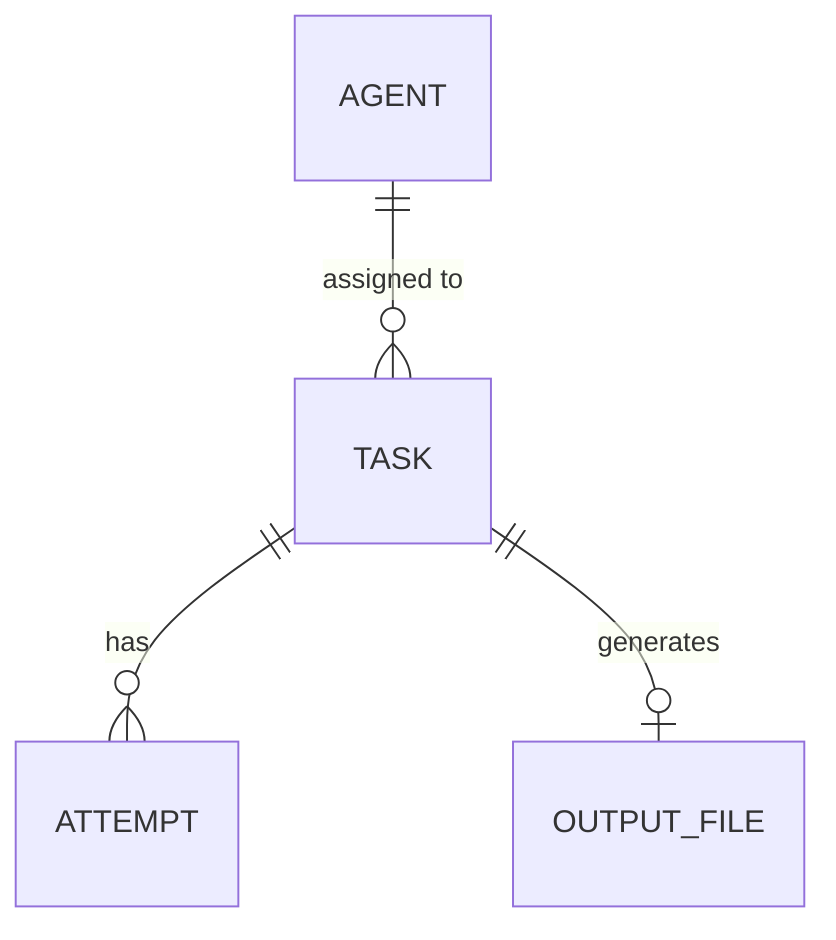

# Data Model and Persistence Design

**Iteration:** Iteration 1  
**Task ID:** S1-04  
**Assignee:** İrem Yılmaz (Scrum Master)  
**Reviewer:** Mahmut Karaalioğlu  

## 1. Persistent Storage vs. In-Memory State (State Allocation)
In our distributed AI agent platform, data is categorized into two main storage types:

**Information Requiring Persistent Storage (Persistent Data):**
* Parsed sub-tasks (Task details, requirements)
* Task assignments and execution statuses (Pending, In Progress, Failed, Completed)
* Persistent agent profiles and their capability scores
* Error logs and execution attempt history (crucial for self-correction)
* Output file metadata and physical repository paths

**State Required Only During Runtime (In-Memory State):**
* Real-time WebSocket/API connection statuses of the agents (Ping/Pong)
* UI (Dashboard) progress bars and temporary render data
* Raw prompts generated and sent to the LLM during active execution

## 2. Candidate Entities and Data Fields (Data Dictionary)

### Agent
* `agent_id` (PK): Unique identifier for the agent
* `name`: Agent name (e.g., Frontend Agent, Backend Agent)
* `model_type`: The underlying LLM model (e.g., GPT-X, Model-Y)
* `coding_cap`, `reasoning_cap`, `context_cap`: Evaluated capability scores
* `status`: Current execution state (IDLE, BUSY, OFFLINE)

### Task
* `task_id` (PK): Unique task identifier
* `description`: Task requirements and description
* `required_capability`: The primary capability required to complete the task
* `assigned_agent_id` (FK): The agent assigned to execute the task
* `status`: Current task state (PENDING, IN_PROGRESS, COMPLETED, FAILED)

### Attempt - *For System Error Detection & Recovery*
* `attempt_id` (PK): Attempt iteration number
* `task_id` (FK): Associated task
* `agent_id` (FK): Agent executing the attempt
* `error_log`: Stack trace or error message in case of failure
* `is_successful`: Boolean flag indicating attempt result

### Output File
* `file_id` (PK): Unique file identifier
* `task_id` (FK): The task that generated this file
* `file_name`: Name of the generated file (e.g., `login.py`)
* `file_path`: Physical relative path within the shared repository
* `content_hash`: File hash to detect unauthorized or conflicting modifications

## 3. Storage Options Comparison
Currently, agent capabilities are stored statically in `config/agents_config.json`. However, this is insufficient for asynchronous task management.

| Method | Advantages | Disadvantages | Decision |
| :--- | :--- | :--- | :--- |
| **JSON / In-Memory** | Fast execution, zero setup required. | Total data loss on system crash. Prone to data corruption during concurrent writes by multiple agents. | **Rejected.** Unsafe for asynchronous distributed architecture. |
| **SQLite** | File-based, zero configuration required (Ideal for MVP). ACID compliant. Prevents locks with WAL (Write-Ahead Logging) mode. | May face performance bottlenecks in highly concurrent, multi-server production environments. | **Accepted.** Ideal solution for Sprints 1 and 2. |
| **PostgreSQL** | Most robust solution for distributed and production systems. | Requires Docker or local server installation for every developer. Over-engineering for Iteration 1. | **Postponed.** (Can be migrated from SQLite later if needed). |

## 4. Entity-Relationship Diagram (ERD) Draft

## 5. Open Questions and Decision Inputs for Iteration 2 (S2-07)
Output Files: Should we store the actual code strings returned by the LLM in the database (as BLOB/TEXT), or write them directly to the disk (.py, .js) and only store the file_path in the database? (Recommendation: Writing to disk and storing the path is safer for Git integration).

Attempt History: Should we implement a periodic pruning mechanism for the Attempt table to prevent database bloat from tasks that fail repeatedly?